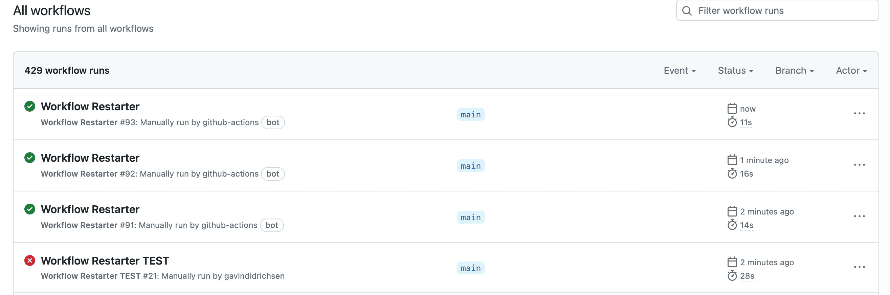
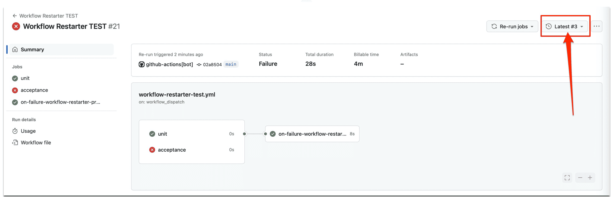
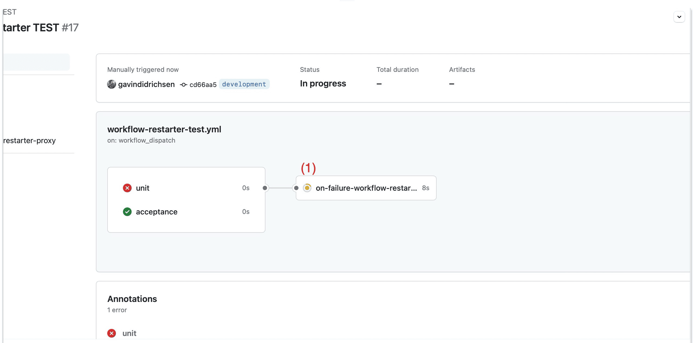
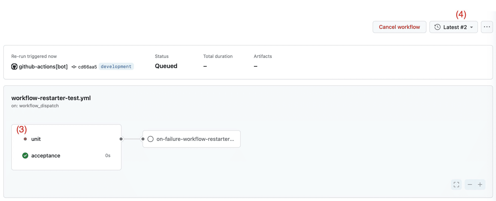

# workflow-restarter

## Description

Although GitHub provides built-in programatic mechanisms for retrying individual steps within a workflow, it doesn't provide one for retrying entire workflows.  One possible reason for this limitation may be to prevent accidental infinite retry loops around failing workflows.  Any workflow that fails, however, can be manually re-started from the failed workflow on the `Actions` tab of the repository.  For more information on restarting github worklows see [Re-running workflows and jobs](https://docs.github.com/en/actions/managing-workflow-runs/re-running-workflows-and-jobs).

Nevertheless, it is possible to programmatically restart a workflow after it fails and the section below shows how to restart a failing workflow 3 times using the `workflow-restarter` re-usable workflow.

## Usage

If setting up the the `workflow-restarter` for the first time, then make sure to initialize it first and then configure another workflow to programmatically restart on failure.

### Initialize the `Workflow Restarter`

First, configure the `workflow-restarter-proxy` custom action by copying this `workflow-restarter-proxy` directory beneath the `.github/actions` directory in your repository.

Second, configure the `workflow-restarter` re-usable workflow (and it's test workflow `workflow-restarter-test`):

```bash
# cd to the `workflow-restarter-proxy` custom action directory
cd .github/actions/workflow-restarter-proxy`

# copy the `workflow-restarter` re-usable workflow to the appropriate directory
cp workflow-restarter-test.yml.sample ../../workflows/workflow-restarter-test.yml
cp workflow-restarter.yml.using_gh ../../workflows/workflow-restarter.yml
```

Third, commit the above to the `main` branch of your repository.  I've called this "priming" the workflows because if you don't commit these workflows to the `main` branch initially, then they won't appear on the github "Actions" tab of your repository.
Committing these new workflows should not interfere with any existing github workflow

Finally, verify that the `workflow-restarter.yml` performs as expected:  Kick off the `workflow-restarter-test` and it should fail and be re-started 3 times.  For example output see the [appendix below](#verify-workflow-restarter-with-workflow-restarter-test).

### Configure an existing workflow to use `on-failure-workflow-restarter`

Now add something like the following `yaml` job at the end of your workflow, changing only the `needs` section to suit.  

For example, the following will trigger a restart if either the `acceptance` or the `unit` jobs preceeding it fail.  A restart of the failing jobs will be attempted 3 times at which point if the failing jobs continue to fail, then the workflow will be marked as failed.  If, however, at any point the `acceptance` and `unit` both pass fine then the restarted workflow will be marked as successful

```yaml
  on-failure-workflow-restarter-proxy:
    # (1) run this job after the "acceptance" job and...
    needs: [acceptance, unit]
    # (2) continue ONLY IF "acceptance" fails
    if: always() && needs.acceptance.result == 'failure' || needs.unit.result == 'failure'
    runs-on: ubuntu-latest
    steps:
      # (3) checkout this repository in order to "see" the following custom action
      - name: Checkout repository
        uses: actions/checkout@v2

      # (4) "use" the custom action to retrigger the failed "acceptance job" above
      # NOTE: pass the SOURCE_GITHUB_TOKEN to the custom action because (a) it must have
      # this to trigger the reusable workflow that restarts the failed job; and
      # (b) custom actions do not have access to the calling workflow's secrets
      - name: Trigger reusable workflow
        uses: ./.github/actions/workflow-restarter-proxy
        env:
          SOURCE_GITHUB_TOKEN: ${{ secrets.GITHUB_TOKEN }}
        with:
          repository: ${{ github.repository }}
          run_id: ${{ github.run_id }}
```

## Appendix

### Verify `Workflow Restarter` with `Workflow Restarter TEST`

The following shows 3 `Workflow Restarter` occuring after the `Workflow Restarter TEST`, which is set to fail continuously.



Looking closer at the `Workflow Restarter TEST` reveals

* that the workflow includes 2 jobs `unit` and `acceptance`; and
* that the workflow has been re-run 3 times, e.g.,



Further, the following sequence of screenshots shows that only failed jobs are re-run.

* The `on-failure-workflow-restarter` job **(1)** is triggered by the failure of the `unit` job and **(2)** successfully calls the `workflow-restarter` workflow
* The `workflow-restarter` in turn triggers a re-run of the `unit` job **(3)** and the `Workflow Restarter TEST` shows this as an incremented attempt count at **(4)**.





