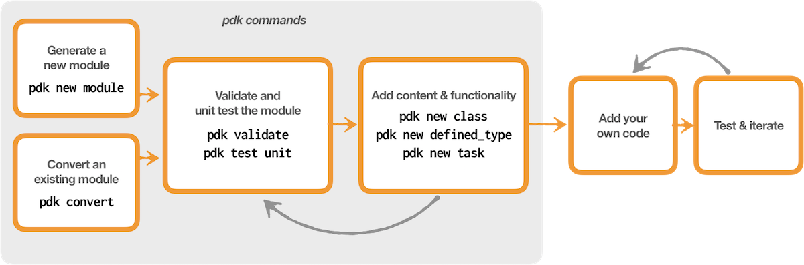

# Developing modules with PDK

Create a complete module with classes, defined types, and tasks, and test and
validate your work as you go.

PDK provides a complete module structure, templates for classes, defined types,
and tasks, and a testing infrastructure. You can validate and test your module
against various operating systems and multiple Puppet versions.

You can also convert existing modules to make them compatible with PDK. This
allows you to use all of the creation, validation, and testing tools in PDK with
the converted module.

## PDK development workflow

1.  Create a module or convert an existing module to make it compatible with
    PDK.

2.  Validate your module to verify that it is well-formed.

3.  Unit test your module to verify that all dependencies and directories are
    present.

4.  Generate classes, defined types, or tasks in your module.

5.  Validate and test your module each time you add new functionality.

When you validate and run unit tests on your module, you can check it against
specific versions of Puppet and Puppet Enterprise® (PE). This can help you ensure compatibility with
multiple versions of Puppet and make upgrades smoother. 

PDK can unit test code that it generates, but for any other code you add, you'll
need to write unit tests. As you add code to your module, validate and unit test
your module before and after adding code. This ensures that you are always
developing on a clean, valid codebase.

## PDK package

PDK includes development and testing tools built by Puppet and by the Puppet
open source community. PDK also installs its own Ruby environment and any gems
it needs.

|Tool|Description|Owned by Puppet|
|----|-----------|---------------|
|facterdb|A gem that contains facts for Operating Systems.| N |
|metadata-json-lint|Validates and lints `metadata.json` files in modules against Puppet module metadata style guidelines.| N |
|pdk|Tool to generate and test modules and module content, such as classes, from the command line.| Y |
|puppet-lint|Checks your Puppet code against the recommendations in the Puppet language style guide.| Y |
|puppet-syntax|Checks for correct syntax in Puppet manifests, templates, and Hiera YAML.| N |
|puppetlabs_spec_helper|Provides classes, methods, and Rake tasks to help with spec testing Puppet code.| Y |
|rspec-puppet|Tests the behavior of Puppet when it compiles your manifests into a catalog of Puppet resources.| Y |
|rspec-puppet-facts|Adds support for running `rspec-puppet` tests against the facts for your supported operating systems.| N |
